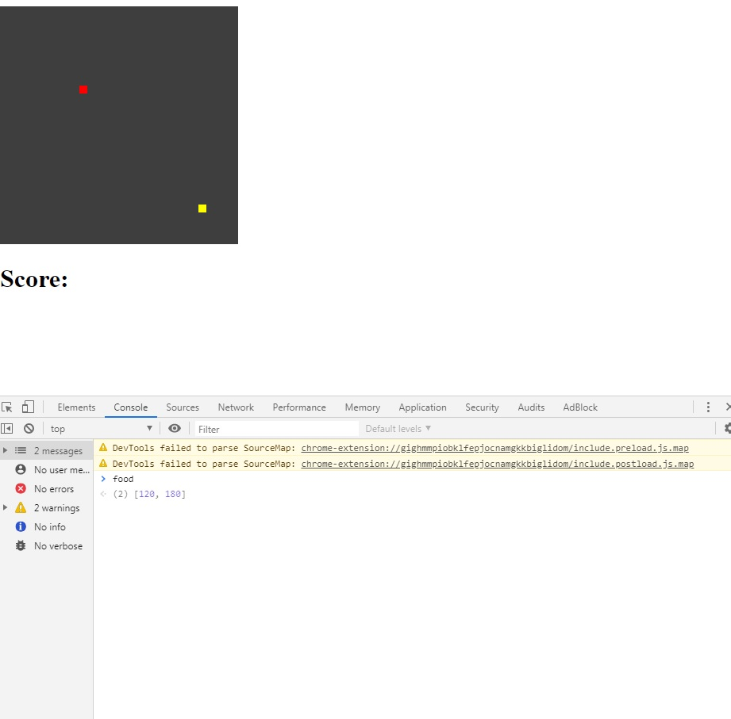

# xxx

## Table of contents

* [General info](#general-info)
* [Screenshots](#screenshots)
* [Technologies](#technologies)
* [Setup](#setup)
* [Status](#status)

## General info
My project is a Snake game. I did it to develop my JS skills and have some fun with game creation.

## Screenshots

## Technologies
* JavaScript 

## Demo
https://github.com/BadVilgo/SnakeGame/

## Status
Project is: _inProgres_.

